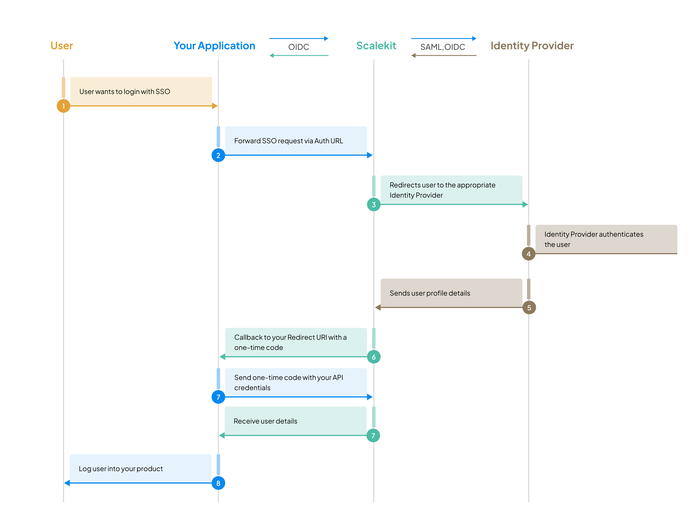

<h1 align="center">
  <a href="https://scalekit.com" target="_blank" rel="noopener noreferrer">
    <picture >
      
    </picture>
  </a>
  <br/>
    <a href="https://www.npmjs.com/package/@scalekit-sdk/node">
    
  </a>
  <a href="https://www.scalekit.com/?intent=earlyaccess&utm_source=docs">
  
  </a>
  <a>
    
  </a>
    <a href="https://docs.scalekit.com">
    
  </a>
  <a>
  
  </a>

</h1>

<p align="center">
  <em><a href="https://scalekit.com">Scalekit</a> is your gateway to <b>enterprise-readiness</b> for B2B and SaaS applications. Built on <a href="https://openid.net/">OpenID</a> and <a href="https://en.wikipedia.org/wiki/SAML_2.0">SAML</a> standards, it provides seamless <b>authentication</b>, <b>user management</b>, and <b>access control</b> capabilities. Scalekit enables you to focus on <b>core product development</b> while we handle the complexities of <b>enterprise authentication</b>.</em>
</p>

---

## ⚙️ Installation

Scalekit's Node.js SDK requires **Node.js version 18.x** or later to run. To install or upgrade Node.js, refer to the [official Node.js installation guide](https://nodejs.org/en/download). To start setting up, go to your Node project's root directory and run following command:

```sh
npm install @scalekit-sdk/node
```

Other package managers like Yarn and pnpm are also supported.

```sh
yarn add @scalekit-sdk/node
```

```sh
pnpm add @scalekit-sdk/node
```

```sh
bun add @scalekit-sdk/node
```

## Usage

Scalekit SDK establishes an enterprise-ready authentication server that can be set up for an application by providing API credentials (Currently, Early Access) during SDK initialization.

```js
import { ScalekitClient } from '@scalekit-sdk/node';

const scalekit = new ScalekitClient(
  process.env.SCALEKIT_ENV_URL,
  process.env.SCALEKIT_CLIENT_ID,
  process.env.SCALEKIT_CLIENT_SECRET
);
```

<details>
  <summary> 💭 Remind me the sequence of single sign-on</summary>
 <figure>
  
  <figcaption>Sequence where Scalekit fits in your application</figcaption>
</figure>
</details>
<br/>

```javascript
/**
 * Import ScalekitClient as scalekit
 * Create an Express app instance
*/

const redirectUri = `${process.env.HOST}/auth/callback`;


app.get("/auth/login", (req, res) => {
  const authUrl = scalekit.getAuthorizationUrl(
    redirectUri,
    {
      state: "state",
      connectionId: "connection_id",
    }
  );
  res.redirect(authUrl);
});

app.get("/auth/callback", async (req, res) => {
  const { code, error, error_description, idp_initiated_login } = req.query;
  // Handle error
  if (error) {
    return res.status(400).json({ error, error_description });
  }
  // Handle IdP initiated login
  if (idp_initiated_login) {
    // Get the claims from the IdP initiated login
    const {
      connection_id,
      organization_id,
      login_hint,
      relay_state
    } = await scalekit.getIdpInitiatedLoginClaims(idp_initiated_login as string);

// Get the authorization URL and redirect the user to the IdP login page
    const url = scalekit.getAuthorizationUrl(
      redirectUri,
      {
        connectionId: connection_id,
        organizationId: organization_id,
        loginHint: login_hint,
        ...(relay_state && { state: relay_state }),
      }
    )

   return res.redirect(url);
  }
  const authResp = await scalekitClient.authenticateWithCode(code, redirectUri);
  res.cookie("access_token", authResp.accessToken);
  return res.json(authResp.accessToken);
});

```

## 🧩 API

#### scalekit.getAuthorizationUrl(redirectUri, options)

Return Type: `string`

Returns the authorization URL and redirect the user to the IdP login page

```sh
https://auth.scalekit.com/authorize
  ?client_id=skc_1220XXXXX349527
  &redirect_uri=https://yourapp.com/auth/callback
  &provider=google
```

**`redirectUri`**

Type: `string`

The URL to redirect the user to after the user has logged in. For example, `https://b2b-app.com/auth/callback`.

**`options`**

Type: `object`

Any one of the following identifiers can be used to generate the Authorization URL:

- `connectionId` - The connection ID to use for the login. For example, `conn_1220XXXXX349527`.
- `organizationId` - The organization ID to use for the login. For example, `org_1220XXXXX349527`.
- `loginHint` - The login hint to use for the login. For example, `user@example.com`.

Read more about [Authorization URL](https://docs.scalekit.com/sso/guides/key-concepts/authorization-url)

#### scalekit.authenticateWithCode(code, redirectUri, options?)

Return Type: `object`

Returns an object containing user profile details (`idToken` in JSON Web Token format) along with access token.

**`code`**

Type: `string`

The code sent to the redirect URL (`/auth/callback`) in it's redirect query parameter.

**`redirectUri`**

Type: `string`

The URL to redirect the user to after the user has logged in. For example, `https://b2b-app.com/auth/callback`.

#### scalekit.getIdpInitiatedLoginClaims(idpInitiatedLoginToken)

Return Type: `object`

Returns the identifiers needed to generate the authorization URL when users login using their Identity Provider (IdP). (a.k.a. IdP initiated login)

**`idpInitiatedLoginToken`**

Type: `string` (JSON Web Token format)

The value of `idp_initiated_login` query parameter from the redirect URL.

For detailed information on each option and parameter, please refer to our [API Reference](https://docs.scalekit.com/apis) 📚.

## 🔍 Examples

Scan through the examples for [Express.js](https://github.dev/scalekit-inc/scalekit-express-example) and [Next.js](https://github.dev/scalekit-inc/scalekit-nextjs-example).

```sh
# Clone Express.js example
git clone https://github.com/scalekit-inc/scalekit-express-example.git

# Clone Next.js example
git clone https://github.com/scalekit-inc/scalekit-nextjs-example.git
```

## 🤝 Contributing

Thank you for considering contributing to the Scalekit SDK!

- Feel free to open an issue or submit a pull request.
- Become a [stargazer](https://github.com/scalekit-inc/scalekit-sdk-node/stargazers) of this repository.
- Write a blog post of what you built with Scalekit.

---

This project is licensed under the MIT License - see the [LICENSE](LICENSE) file for details.

<p align="center">
  Made with ❤️ by the Scalekit team
</p>
